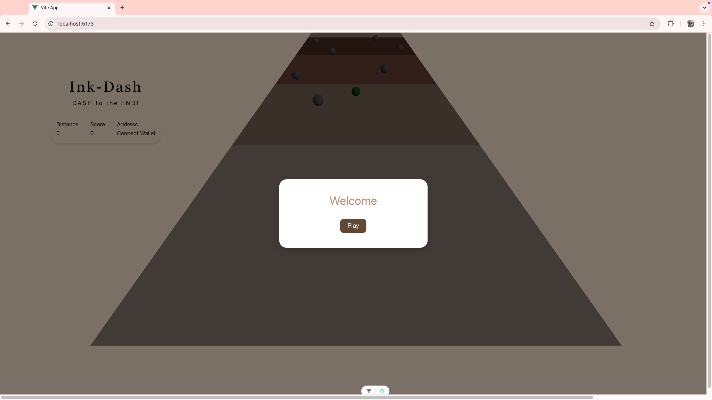
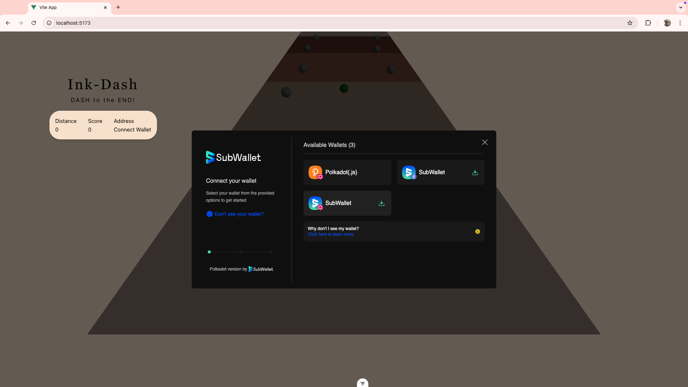
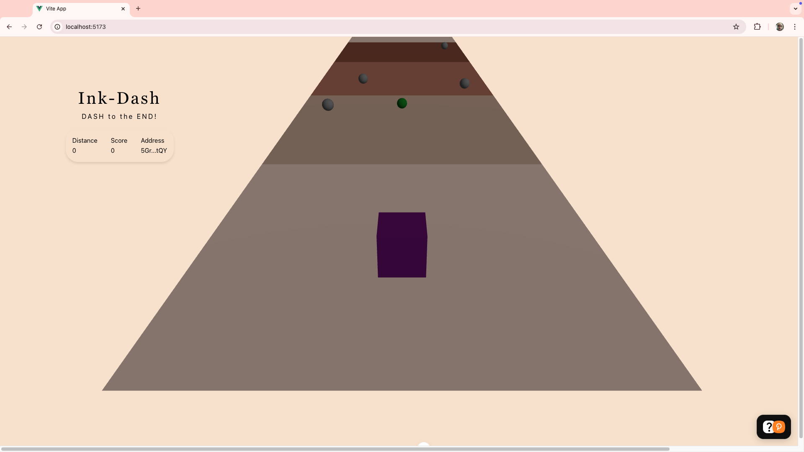
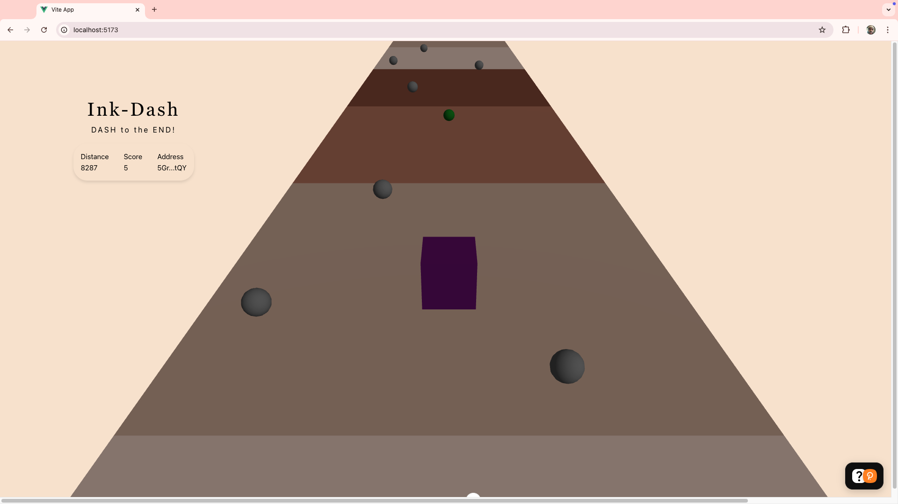

# inkdash

This is a silly POC game that allows players to dash to the end while collecting items on each plane, the goal is to get the best score and time and in the end the top 3 win tokens

## Installation

Before proceeding i suggest you install <a href="https://www.rust-lang.org/tools/install">Rust</a> and <a href="https://github.com/use-ink/cargo-contract">Cargo Contract</a>

Once the above is talled to get started ensure you head on over to the <a href="https://use.ink/">Ink documentation website</a> to get a better grasp of how ink works
The proceeed to installing <a href="https://onpop.io/"> OnPop</a> to help you get started with building on Polkadot like setting up a local Parachain deploying etc.

The UI part is not complete see the <b>UI</b> folder for how to install the required packages

## Testing

To test any of the smartcontract see the <b>Makefile</b> on the root folder

## @DEV

The code is incomplete it still requires testing of cross contract calls

## Screenshots

1. 
2. 
3. 
4. 
